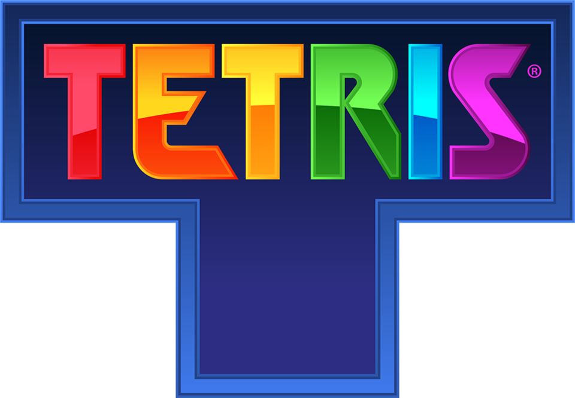

# Tetris Maestro | Modern Rhythm Edition



[](https://opensource.org/licenses/MIT)
[](https://www.python.org/)
[](https://github.com/psf/black)

## Описание

**Tetris** — это классическая видеоигра-головоломка, созданная советским программистом `Алексеем Пажитновым` в `1984` году.

Игра стала всемирным феноменом благодаря своей простой, но увлекательной механике.

### 🎮 Управление

|------------------|---------|
| Действие         | Клавиша |
| Движение влево   | ← / A   |
| Движение вправо  | → / D   |
| Поворот фигуры   | ↑ / W   |
| Ускорение падения| ↓ / S   |
| Пауза / Музыка   | P / M   |
|------------------|---------|

--

### Идеи для улучшения проекта

1. Добавить различные уровни сложности
2. Создать окно с настройками игры, сохранения, загрузки, регулировани уровня громкости
3. - // -
4. - // -
5. - // -

--

### 📄 Лицензия

[Этот проект лицензирован под лицензией MIT](LICENCE)

Для получения дополнительной информации ознакомьтесь с файлом `LICENSE`

--

💼 **Автор:** Дуплей Максим Игоревич

📲 **Telegram:** @quadd4rv1n7

📅 **Дата:** 12.03.2025

▶️ **Версия 1.0**

```textline
※ Предложения по сотрудничеству можете присылать на почту ※
📧 maksimqwe42@mail.ru
```
